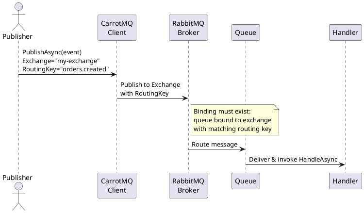

# Custom Routing Events

## What Is ICustomRoutingEvent?

`ICustomRoutingEvent<TEvent>` is a message contract where the **exchange** and **routing key** are properties on the message itself, resolved at runtime rather than statically bound to the type.

This contrasts with `IEvent`, where the target exchange is determined at compile time by the type definition.

---

## When to Use It

Use `ICustomRoutingEvent<TEvent>` when:

- You need to route the same message type to **different exchanges or routing keys** based on runtime data.
- You want to avoid defining a separate DTO for each possible routing target.
- You are building a generic relay, fan-out, or dynamic dispatch component.

---

## DTO Definition

Implement `ICustomRoutingEvent<TEvent>` and declare the `Exchange` and `RoutingKey` properties:

```csharp
public class MyCustomRoutingEvent : ICustomRoutingEvent<MyCustomRoutingEvent>
{
    public required string Exchange { get; set; }
    public required string RoutingKey { get; set; }
    public string Message { get; set; } = string.Empty;
}
```

The `Exchange` and `RoutingKey` properties are read by CarrotMQ when publishing and used directly as the AMQP destination — no additional configuration is required.

---

## Publishing

Publish a custom routing event exactly as you would any other message. Set `Exchange` and `RoutingKey` when constructing the message:

```csharp
await carrotClient.PublishAsync(new MyCustomRoutingEvent
{
    Exchange = "my-exchange",
    RoutingKey = "orders.created",
    Message = "Order 42 was created"
});
```

You can vary `Exchange` and `RoutingKey` per call without changing the message type:

```csharp
await carrotClient.PublishAsync(new MyCustomRoutingEvent
{
    Exchange = "my-exchange",
    RoutingKey = "orders.cancelled",
    Message = "Order 42 was cancelled"
});
```

---

## Consuming

### Registering a Consumer

Use `AddCustomRoutingEvent` to register a handler, or `AddCustomRoutingEventSubscription` to register a subscription without an explicit handler class:

```csharp
// With an explicit handler
builder.Handlers.AddCustomRoutingEvent<MyCustomRoutingEventHandler, MyCustomRoutingEvent>();

// Subscription only (e.g. when using a generic/pipeline handler)
builder.Handlers.AddCustomRoutingEventSubscription<MyCustomRoutingEvent>();
```

### Handler Implementation

Derive from `EventHandlerBase<TEvent>` and implement `HandleAsync`:

```csharp
public class MyCustomRoutingEventHandler : EventHandlerBase<MyCustomRoutingEvent>
{
    public override async Task<IHandlerResult> HandleAsync(
        MyCustomRoutingEvent message,
        ConsumerContext context,
        CancellationToken ct)
    {
        Console.WriteLine(
            $"Received on {message.Exchange}/{message.RoutingKey}: {message.Message}");

        return Ok();
    }
}
```

---

## Important: Queue Binding

Unlike `IEvent`, `ICustomRoutingEvent<TEvent>` has **no static binding** to a specific exchange at the type level. CarrotMQ does not automatically create exchange or queue bindings for custom routing events.

**You are responsible for ensuring** that the queue your consumer is attached to is already bound to the relevant exchange with an appropriate routing key pattern (e.g. `orders.*`) — either via broker configuration, infrastructure-as-code, or the CarrotMQ topology builder.

---

## Routing Flow Diagram


