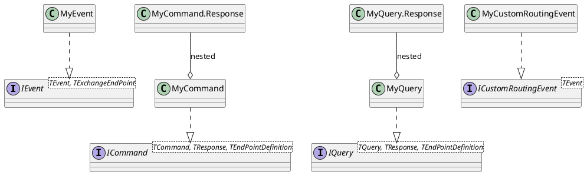

# Message Types

CarrotMQ defines four message type interfaces, each representing a distinct messaging pattern. All message types are defined in your **shared DTO library** (which references only `CarrotMQ.Core`) so that both producers and consumers can share the same contracts without coupling to the transport layer.

---

## Type Hierarchy



---

## IEvent

**Pattern:** Publish / Subscribe  
**Response:** None (fire-and-forget)

An event represents something that **has happened**. It is published to an exchange and consumed by zero or more subscribers. The publisher does not wait for a response — it fires the message and continues.

Use `IEvent` when:
- You want to notify other services of a state change.
- Multiple services may need to react to the same occurrence.
- No reply is required or expected.

### Interface Definition

```csharp
public interface IEvent<TEvent, TExchangeEndPoint>
    where TEvent : IEvent<TEvent, TExchangeEndPoint>
    where TExchangeEndPoint : ExchangeEndPoint, new();
```

### Usage

```csharp
// Shared DTO library (references CarrotMQ.Core only)
public class OrderPlacedEvent : IEvent<OrderPlacedEvent, OrderEventsExchange>
{
    public Guid OrderId { get; set; }
    public decimal TotalAmount { get; set; }
}

public class OrderEventsExchange : ExchangeEndPoint
{
    public OrderEventsExchange() : base("order-events") { }
}
```

---

## ICommand

**Pattern:** Request / Reply  
**Response:** Strongly-typed `TResponse`

A command represents an **intent to change state**. It is sent to a specific endpoint (typically a queue) and processed by exactly one consumer, which returns a strongly-typed response. The sender can either await the reply synchronously (using `SendReceiveAsync`) or send and monitor separately.

Use `ICommand` when:
- You need to trigger an action on another service.
- A response is required to confirm success, failure, or return data.
- Only one service should process the message.

### Interface Definition

```csharp
public interface ICommand<TCommand, TResponse, TEndPointDefinition>
    where TCommand : ICommand<TCommand, TResponse, TEndPointDefinition>
    where TResponse : class
    where TEndPointDefinition : EndPointBase, new();
```

### Usage

```csharp
// Shared DTO library (references CarrotMQ.Core only)
public class CreateOrderCommand : ICommand<CreateOrderCommand, CreateOrderCommand.Response, OrderQueue>
{
    public Guid CustomerId { get; set; }
    public List<OrderLine> Lines { get; set; } = [];

    public class Response
    {
        public Guid OrderId { get; set; }
    }
}

public class OrderQueue : QueueEndPoint
{
    public OrderQueue() : base("order-service") { }
}
```

---

## IQuery

**Pattern:** Request / Reply  
**Response:** Strongly-typed `TResponse`

A query is semantically identical to a command in terms of transport, but it represents a **read operation** with no side effects. Separating queries from commands follows CQRS conventions and makes the intent of each message explicit.

Use `IQuery` when:
- You need to fetch data from another service.
- The operation should not change state.
- A single service owns the data being queried.

### Interface Definition

```csharp
public interface IQuery<TQuery, TResponse, TEndPointDefinition>
    where TQuery : IQuery<TQuery, TResponse, TEndPointDefinition>
    where TResponse : class
    where TEndPointDefinition : EndPointBase, new();
```

### Usage

```csharp
// Shared DTO library (references CarrotMQ.Core only)
public class GetOrderQuery : IQuery<GetOrderQuery, GetOrderQuery.Response, OrderQueue>
{
    public Guid OrderId { get; set; }

    public class Response
    {
        public Guid OrderId { get; set; }
        public string Status { get; set; } = string.Empty;
        public decimal TotalAmount { get; set; }
    }
}
```

> [!NOTE]
> `GetOrderQuery` reuses the same `OrderQueue` endpoint defined for `CreateOrderCommand`. Multiple message types can share a single queue endpoint — the handler is resolved by message type.

---

## ICustomRoutingEvent

**Pattern:** Dynamic Publish  
**Response:** None (fire-and-forget)

`ICustomRoutingEvent` is a fire-and-forget event where the **exchange and routing key are not determined at compile time** but are instead set as properties on the message instance at runtime. This is useful for scenarios where the routing logic is data-driven (e.g., tenant-based routing, dynamic topic hierarchies).

Use `ICustomRoutingEvent` when:
- The target exchange or routing key varies per message instance.
- You need full control over AMQP routing at the point of publishing.
- Static compile-time endpoint binding is too rigid for your use case.

### Interface Definition

```csharp
public interface ICustomRoutingEvent<TEvent>
    where TEvent : ICustomRoutingEvent<TEvent>
{
    string Exchange { get; set; }
    string RoutingKey { get; set; }
}
```

### Usage

```csharp
// Shared DTO library (references CarrotMQ.Core only)
public class TenantNotificationEvent : ICustomRoutingEvent<TenantNotificationEvent>
{
    public required string Exchange { get; set; }
    public required string RoutingKey { get; set; }

    public string Message { get; set; } = string.Empty;
}

// Publisher side — routing is resolved at runtime
await publisher.PublishAsync(new TenantNotificationEvent
{
    Exchange   = $"tenant-{tenantId}-events",
    RoutingKey = "notifications.alert",
    Message    = "Your subscription is about to expire."
});
```

---

## Choosing Between `ICommand` and `IQuery`

`ICommand` and `IQuery` are **transport-identical** — both send to a configurable endpoint and return a strongly-typed response. The distinction is purely semantic:

| | `ICommand` | `IQuery` |
|---|---|---|
| **Intent** | Change state (write) | Read state (read-only) |
| **CQRS role** | Command side | Query side |
| **Side effects** | Expected | None (by convention) |
| **Example** | `CreateOrderCommand` | `GetOrderQuery` |

Use `ICommand` when the operation modifies data. Use `IQuery` when it only retrieves data. This separation follows CQRS conventions and makes the intent of each message explicit to other developers — the runtime behaviour is the same either way.

---

## Summary

| Type | Direction | Expects Reply | Endpoint Type |
|---|---|---|---|
| `IEvent` | Outbound to exchange | No | `ExchangeEndPoint` |
| `ICommand` | Outbound to endpoint | Yes | `QueueEndPoint` (recommended) or `ExchangeEndPoint` |
| `IQuery` | Outbound to endpoint | Yes | `QueueEndPoint` (recommended) or `ExchangeEndPoint` |
| `ICustomRoutingEvent` | Outbound to exchange | No | Runtime properties |
