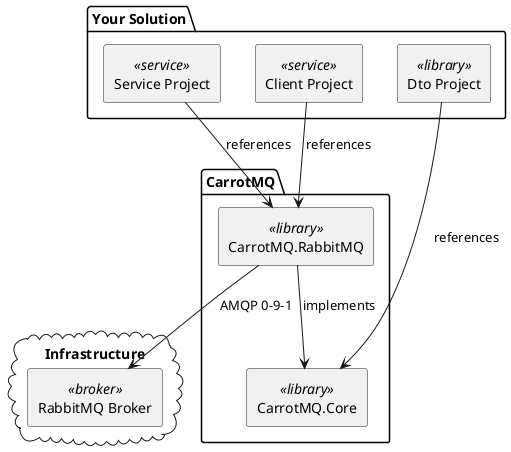

# Architecture Overview

CarrotMQ is a .NET library that brings structure and type safety to RabbitMQ-based microservice communication. It provides a **CQRS-inspired messaging model** where every message is either a command, a query, an event, or a custom-routed event — each with clear semantics and compile-time contracts.

The library is split into two NuGet packages with a deliberate separation of concerns:

| Package | Purpose |
|---|---|
| `CarrotMQ.Core` | Transport-agnostic contracts, interfaces, and base types |
| `CarrotMQ.RabbitMQ` | RabbitMQ-specific implementation, DI integration, and hosted service |

---

## Component Diagram



---

## Package Responsibilities

### CarrotMQ.Core

`CarrotMQ.Core` contains only **transport-agnostic abstractions**:

- Message type marker interfaces (`IEvent`, `ICommand`, `IQuery`, `ICustomRoutingEvent`)
- Endpoint definition base classes (`ExchangeEndPoint`, `QueueEndPoint`)
- Handler result types (`IHandlerResult`, `OkResult`, `RetryResult`, `RejectResult`, `ErrorResult`)
- `EventHandlerBase`, `CommandHandlerBase`, `QueryHandlerBase`, `ResponseHandlerBase` — specialised base classes for message handlers

Because `CarrotMQ.Core` has no dependency on the RabbitMQ client library, your **shared DTO project** should reference only `CarrotMQ.Core`. This keeps your contracts lightweight and decoupled from the transport layer, allowing them to be consumed by any project without pulling in RabbitMQ dependencies.

### CarrotMQ.RabbitMQ

`CarrotMQ.RabbitMQ` is the RabbitMQ implementation of the CarrotMQ abstractions. It provides:

- A hosted service (`IHostedService`) that manages the AMQP connection and channel lifecycle
- Consumer registration and message dispatch
- Publisher implementation for sending commands, queries, and events
- Configuration API for topology declaration (exchanges, queues, bindings)

Both client applications (senders) and service applications (receivers) reference `CarrotMQ.RabbitMQ`.

---

## Message Types and Messaging Patterns

CarrotMQ maps its four message types to standard messaging patterns:

| Message Type | Pattern |
|---|---|
| `IEvent` | Publish / Subscribe |
| `ICommand` | Request / Reply |
| `IQuery` | Request / Reply |
| `ICustomRoutingEvent` | Dynamic Publish |

See [Message Types](message_types.md) for full details on each type.

---

## Dependency Injection and Hosted Service

CarrotMQ integrates with the standard `Microsoft.Extensions.DependencyInjection` and `Microsoft.Extensions.Hosting` infrastructure.

A typical service registration looks like:

```csharp
services.AddCarrotMqRabbitMq(builder =>
{
    builder.ConfigureBrokerConnection(options =>
    {
        options.BrokerEndPoints = [new Uri("amqp://localhost:5672")];
        options.UserName = "guest";
        options.Password = "guest";
        options.VHost = "/";
        options.ServiceName = "MyService";
    });

    DirectExchangeBuilder exchange = builder.Exchanges.AddDirect<MyExchange>();
    QuorumQueueBuilder queue = builder.Queues.AddQuorum<MyQueue>()
        .WithConsumer();

    builder.Handlers.AddEvent<MyEventHandler, MyEvent>()
        .BindTo(exchange, queue);

    builder.StartAsHostedService();
});
```

Internally, `StartAsHostedService()` registers a background `IHostedService` (`CarrotService`) that:

1. Establishes the AMQP connection when the application starts.
2. Declares all configured exchanges, queues, and bindings on the broker.
3. Starts consumers on their configured queues.
4. Gracefully shuts down the connection when the application stops.

`ICarrotClient` is registered in the DI container and can be injected into any service to publish events or send commands and queries.

> [!NOTE]
> If your application only publishes messages (no consumers), you can omit `StartAsHostedService()`. The connection will still be established on the first publish call.
