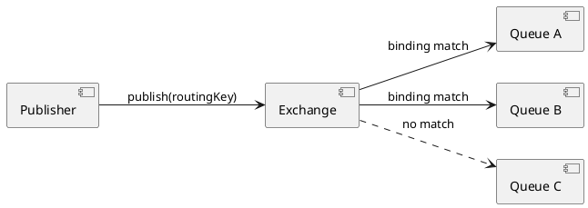

# Exchanges

## What Is an Exchange?

In RabbitMQ, **publishers never send messages directly to queues**. Instead, they publish to an *exchange*, which then routes the message to one or more queues based on its type and the bindings that have been declared.



CarrotMQ **declares exchanges on RabbitMQ at startup** (via `StartAsHostedService()`). If an exchange with the same name already exists and has compatible settings, the declaration is a no-op. If the settings conflict, RabbitMQ will return an error.

---

## Declaring Exchanges

Exchanges are declared using the `builder.Exchanges` collection inside `AddCarrotMqRabbitMq`:

```csharp
services.AddCarrotMqRabbitMq(builder =>
{
    DirectExchangeBuilder exchange = builder.Exchanges.AddDirect<MyExchange>();
});
```

The generic type parameter is used to determine the exchange name: CarrotMQ instantiates the type and reads its `Exchange` property, which is set by the base class constructor. You can also pass a plain string:

```csharp
builder.Exchanges.AddDirect("my-direct-exchange");
```

---

## Exchange Types

### Direct Exchange

**Method:** `AddDirect<T>()` → `DirectExchangeBuilder`

Routes a message to every queue whose binding key **exactly matches** the routing key used when publishing. This is the default exchange type for events and commands in CarrotMQ.

```csharp
DirectExchangeBuilder exchange = builder.Exchanges.AddDirect<MyExchange>()
    .WithDurability(true)
    .WithAutoDelete(false);
```

**Use when:** You want predictable, point-to-point routing between a known set of message types and queues.

---

### Topic Exchange

**Method:** `AddTopic<T>()` → `TopicExchangeBuilder`

Routes based on **pattern matching** against the routing key. Routing keys and binding patterns are dot-separated words (`order.created`, `payment.failed`).

Wildcard characters in binding patterns:

| Wildcard | Matches |
|---|---|
| `*` | Exactly one word |
| `#` | Zero or more words |

```csharp
TopicExchangeBuilder exchange = builder.Exchanges.AddTopic<MyTopicExchange>();
```

**Use when:** You publish categorised events and want consumers to subscribe to subsets using patterns (e.g. `order.*` or `#.failed`).

---

### Fanout Exchange

**Method:** `AddFanOut<T>()` → `FanOutExchangeBuilder`

Routes a copy of every message to **all queues bound to the exchange**, ignoring the routing key entirely.

```csharp
FanOutExchangeBuilder exchange = builder.Exchanges.AddFanOut<MyBroadcastExchange>();
```

**Use when:** You need to broadcast a message to multiple independent consumers simultaneously — for example, cache invalidation or audit logging.

#### Handler Binding with FanOut Exchange

`HandlerExtensions.BindTo` does not have an overload for `FanOutExchange`. Instead, call `.BindToQueue(queue)` on the exchange builder to create the AMQP exchange-to-queue binding (with an empty routing key, as RabbitMQ fanout ignores routing keys). Register the handler separately — no `.BindTo()` call is needed on the handler:

```csharp
FanOutExchangeBuilder exchange = builder.Exchanges.AddFanOut<MyBroadcastExchange>();
QuorumQueueBuilder queue = builder.Queues.AddQuorum<MyQueue>().WithConsumer();

exchange.BindToQueue(queue);   // declares the AMQP binding with empty routing key

builder.Handlers.AddEvent<MyEventHandler, MyEvent>();   // handler dispatch uses the message header
```

Do **not** also call `handler.BindTo(...)` — that would declare a second AMQP binding with a message-type routing key, which is unnecessary and misleading for a fanout exchange.

---

### LocalRandom Exchange

**Method:** `AddLocalRandom<T>()` → `LocalRandomExchangeBuilder`

A RabbitMQ plugin exchange type that routes a message to **one randomly chosen queue** from those bound on the **same RabbitMQ node**. Unlike a regular direct exchange with multiple bindings, only one queue receives each message.

```csharp
LocalRandomExchangeBuilder exchange = builder.Exchanges.AddLocalRandom<MyLocalExchange>();
```

**Use when:** You have multiple consumer queues on the same RabbitMQ node and want to route each published message to exactly one of them, distributing load at the exchange level rather than the queue level.

> **Note:** The `x-local-random` exchange type requires the `rabbitmq_random_exchange` plugin to be enabled on the broker.

#### Handler Binding with LocalRandom Exchange

`HandlerExtensions.BindTo` does not have an overload for `LocalRandomExchange`. Instead, call `.BindToQueue(queue)` on the exchange builder to create the AMQP exchange-to-queue binding (with an empty routing key). Register the handler separately — no `.BindTo()` call is needed on the handler:

```csharp
LocalRandomExchangeBuilder exchange = builder.Exchanges.AddLocalRandom<MyLocalExchange>();
QuorumQueueBuilder queue = builder.Queues.AddQuorum<MyQueue>().WithConsumer();

exchange.BindToQueue(queue);   // declares the AMQP binding with empty routing key

builder.Handlers.AddEvent<MyEventHandler, MyEvent>();   // handler dispatch uses the message header
```

Do **not** also call `handler.BindTo(...)` — that would declare a second AMQP binding with a message-type routing key, which is not appropriate for this exchange type.

#### Routing Behaviour

Unlike a direct exchange where every bound queue matching the routing key receives the message, `x-local-random` delivers the message to **one** randomly chosen bound queue per publish. All queues must be on the same RabbitMQ node as the exchange. If no local queues are bound, the message is dropped.

---

## Common Fluent Options

All exchange builder types expose the following configuration methods:

| Method | Description | Default |
|---|---|---|
| `.WithDurability(bool)` | Exchange survives a broker restart when `true`. Set to `false` for transient exchanges. | `true` |
| `.WithAutoDelete(bool)` | Exchange is automatically deleted by RabbitMQ when the last queue is unbound from it. | `false` |
| `.WithCustomArgument(key, value)` | Sets an arbitrary AMQP exchange argument (e.g. for plugin-specific settings). | — |

```csharp
builder.Exchanges.AddDirect<MyExchange>()
    .WithDurability(true)
    .WithAutoDelete(false)
    .WithCustomArgument("x-delayed-type", "direct");
```

---

## Bindings

A **binding** tells RabbitMQ which routing key (or pattern) connects an exchange to a queue. In CarrotMQ, bindings are created as a side effect of registering a handler:

```csharp
DirectExchangeBuilder exchange = builder.Exchanges.AddDirect<MyExchange>();
QuorumQueueBuilder queue     = builder.Queues.AddQuorum<MyQueue>().WithConsumer();

builder.Handlers.AddEvent<MyEventHandler, MyEvent>()
    .BindTo(exchange, queue);
```

CarrotMQ uses `typeof(TMessage).FullName` as the routing key by default (e.g. `MyNamespace.MyEvent`), so the binding above creates:

```
MyExchange  --[MyNamespace.MyEvent]--> MyQueue
```

Multiple handlers can bind different message types to the same exchange and queue, or to different queues on the same exchange.

---

## Custom Routing Key Resolution

By default, CarrotMQ derives routing keys from the **full type name** of the message class (`DefaultRoutingKeyResolver`). If the full name exceeds the AMQP maximum of 256 characters, the namespace portion is truncated with an ellipsis.

To change how routing keys are generated — for example, to use a short name or an attribute-driven convention — implement `IRoutingKeyResolver` and register it before `AddCarrotMqRabbitMq`:

```csharp
public class ShortNameRoutingKeyResolver : IRoutingKeyResolver
{
    public string GetRoutingKey<TRequest>(string exchangeName)
    {
        // Use only the class name, without the namespace
        return typeof(TRequest).Name;
    }
}
```

Register it as a singleton:

```csharp
services.AddSingleton<IRoutingKeyResolver, ShortNameRoutingKeyResolver>();

services.AddCarrotMqRabbitMq(builder => { ... });
```

> [!WARNING]
> All services that share the same exchanges and queues must use the **same routing key convention**. Changing the resolver on the publisher side without updating the consumer (or the queue binding) will cause messages to be unroutable and dropped by the broker.
