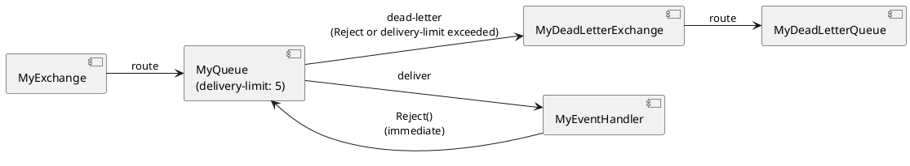

# Queues

## Overview

Queues are the buffers where RabbitMQ holds messages until a consumer processes them. CarrotMQ **declares queues on RabbitMQ at startup** via `StartAsHostedService()`. If a queue already exists with compatible settings, the declaration is a no-op.

Queues are declared using the `builder.Queues` collection:

```csharp
services.AddCarrotMqRabbitMq(builder =>
{
    QuorumQueueBuilder queue = builder.Queues.AddQuorum<MyQueue>();
});
```

The generic type parameter is used to determine the queue name: CarrotMQ instantiates the type and reads its `QueueName` property, which is set by the base class constructor. A plain string overload is also available:

```csharp
builder.Queues.AddQuorum("my-queue-name");
```

---

## Queue Types

### Quorum Queue

**Method:** `AddQuorum<T>()` → `QuorumQueueBuilder`

The **recommended queue type for production**. Quorum queues are replicated across a configurable number of RabbitMQ cluster nodes using the Raft consensus algorithm, providing strong durability and high availability guarantees.

Key characteristics:
- Messages are **always persistent** (cannot be transient).
- Tolerates node failures without message loss.
- Supports delivery limits and built-in dead-lettering.

```csharp
builder.Queues.AddQuorum<MyQueue>()
    .WithDeliveryLimit(5)                           // max delivery attempts before dead-lettering
    .WithDeadLetterExchange<MyDeadLetterExchange>() // where to send rejected messages
    .WithConsumer(c => c.WithSingleAck());          // consumer settings
```

> **Tip:** Always pair quorum queues with a dead-letter exchange in production so that poison messages do not block the queue indefinitely.

---

### Classic Queue

**Method:** `AddClassic<T>()` → `ClassicQueueBuilder`

The traditional RabbitMQ queue type. Suitable for development, testing, and non-critical workloads where replication is not required.

```csharp
builder.Queues.AddClassic("my-queue")
    .WithDurability(true)
    .WithConsumer();
```

Classic queues can be either durable (survives broker restart) or transient (lost on restart), and optionally exclusive or auto-deleted.

---

## Common Queue Options

The following methods are available on all queue builder types:

| Method | Description |
|---|---|
| `.WithDurability(bool)` | Queue survives a broker restart when `true`. |
| `.WithAutoDelete(bool)` | Queue is automatically deleted by RabbitMQ when the last consumer disconnects. |
| `.WithExclusivity(bool)` | Queue is only accessible by the connection that declared it; deleted when that connection closes. |
| `.WithDeadLetterExchange(string)` | Sets the dead-letter exchange by name. Messages that are rejected, expired, or exceed the delivery limit are republished there. |
| `.WithDeadLetterExchange<TExchange>()` | Strongly typed overload — instantiates `TExchange` and uses its `Exchange` property (set by the base class constructor) as the exchange name. |
| `.WithSingleActiveConsumer(bool)` | When `true`, RabbitMQ allows only one consumer to receive messages at a time; others wait in standby. |
| `.WithCustomArgument(key, value)` | Sets an arbitrary AMQP queue argument (e.g. `x-message-ttl`, `x-max-length`). |
| `.WithConsumer(configure?)` | Attaches a consumer to this queue. Accepts an optional delegate to configure consumer-specific options. |

---

## Attaching a Consumer

Call `.WithConsumer()` on the queue builder to tell CarrotMQ to start a consumer for that queue when `StartAsHostedService()` runs:

```csharp
builder.Queues.AddQuorum<MyQueue>()
    .WithConsumer();
```

Pass a configuration delegate to customise consumer behaviour:

```csharp
builder.Queues.AddQuorum<MyQueue>()
    .WithConsumer(c => c
        .WithSingleAck()   // acknowledge one message at a time
        .WithPrefetchCount(10));
```

See [Consumer Configuration](consumer_configuration.md) for the full set of consumer options.

---

## Dead-Letter Exchange

When a handler returns a `Reject` result — or a message exceeds the delivery limit on a quorum queue — RabbitMQ republishes the message to the configured **dead-letter exchange**. This lets you capture, inspect, and reprocess failed messages without losing them.

### Setup

```csharp
// 1. Declare the dead-letter exchange (FanOut) and queue, then bind them
var dlx = builder.Exchanges.AddFanOut<MyDeadLetterExchange>();
var dlq = builder.Queues.AddQuorum<MyDeadLetterQueue>();

dlx.BindToQueue(dlq);   // declares the DLX→DLQ binding with empty routing key

// 2. Point the main queue at the dead-letter exchange
builder.Queues.AddQuorum<MyQueue>()
    .WithDeadLetterExchange<MyDeadLetterExchange>()
    .WithDeliveryLimit(5)   // quorum queues only
    .WithConsumer();
```

> **Note:** Using a `FanOut` exchange as the DLX means routing keys are ignored — dead-lettered messages from any queue bound to this DLX are routed to the DLQ regardless of their original routing key. This is the simplest and most reliable pattern for a dead-letter exchange in CarrotMQ.



> **Note:** The dead-letter exchange must be declared before or alongside the queue that references it. CarrotMQ handles declaration order automatically.

---

## String-Name Overloads

Both `AddQuorum` and `AddClassic` accept either a generic type parameter or a plain string name. The two forms are equivalent:

```csharp
// Strongly typed — queue name is whatever MyQueue passes to base(...)
// e.g. public MyQueue() : base("my-queue") {} → queue name is "my-queue"
builder.Queues.AddQuorum<MyQueue>();

// String name — queue name is exactly "my-queue-name"
builder.Queues.AddQuorum("my-queue-name");
```

Use the strongly typed form when you have a dedicated marker class for the queue; use the string form when integrating with existing queues whose names are fixed.
