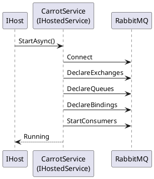

# Setup & Bootstrap

This page walks you through installing CarrotMQ and wiring it into your .NET host from the simplest possible configuration up to a full service with exchanges, queues, and message handlers.

---

## Installation

CarrotMQ is split into two packages:

| Package | Purpose |
|---|---|
| `CarrotMQ.RabbitMQ` | Full runtime: connection, consumers, publishers. Add this to your service project. |
| `CarrotMQ.Core` | DTOs, interfaces, and message contracts only. Add this directly to shared DTO projects; it is already a transitive dependency of `CarrotMQ.RabbitMQ`. |

```bash
dotnet add package CarrotMQ.RabbitMQ
```

For a shared DTO/contracts project that does **not** need a RabbitMQ connection:

```bash
dotnet add package CarrotMQ.Core
```

### Framework Compatibility

Both packages target the following frameworks:

| Target Framework | Supported |
|---|---|
| `net10.0` | ✅ |
| `net9.0` | ✅ |
| `net8.0` | ✅ |
| `netstandard2.0` | ✅ |

> **Note:** `netstandard2.0` support allows use in projects that cannot target a specific .NET version. When targeting `net8.0` or later, all platform-native APIs and performance improvements are available.

---

## Minimal Bootstrap

The only mandatory step is calling `AddCarrotMqRabbitMq` and configuring the broker connection:

```csharp
services.AddCarrotMqRabbitMq(builder =>
{
    builder.ConfigureBrokerConnection(configureOptions: options =>
    {
        options.BrokerEndPoints = [new Uri("amqp://localhost:5672")];
        options.UserName = "guest";
        options.Password = "guest";
        options.VHost = "/";
        options.ServiceName = "MyService";
    });
});
```

This registers all CarrotMQ services in the DI container and makes the publisher available via `ICarrotClient`. No consumers are started and no exchanges or queues are declared until you add them explicitly.

---

## Full Service Bootstrap

The example below shows the typical setup for a service that both **publishes** and **consumes** messages:

```csharp
services.AddCarrotMqRabbitMq(builder =>
{
    builder.ConfigureBrokerConnection(configureOptions: options =>
    {
        options.BrokerEndPoints = [new Uri("amqp://localhost:5672")];
        options.UserName = "guest";
        options.Password = "guest";
        options.VHost = "/";
        options.ServiceName = "MyService";
    });

    // Define exchanges (will be declared on RabbitMQ at startup)
    DirectExchangeBuilder exchange = builder.Exchanges.AddDirect<MyExchange>();

    // Define queues (will be declared on RabbitMQ at startup)
    QuorumQueueBuilder queue = builder.Queues.AddQuorum<MyQueue>()
        .WithConsumer();

    // Register handlers and create bindings
    builder.Handlers.AddEvent<MyEventHandler, MyEvent>()
        .BindTo(exchange, queue);

    // Register as a hosted service (starts consumers with the application)
    builder.StartAsHostedService();
});
```

### What happens at startup



---

## Loading Connection Options from `appsettings.json`

Instead of hard-coding credentials, read them from configuration:

```csharp
builder.ConfigureBrokerConnection(sectionName: "BrokerConnection");
```

The section name defaults to `"BrokerConnection"` so the call above is equivalent to passing no arguments. The corresponding `appsettings.json` section:

```json
{
  "BrokerConnection": {
    "BrokerEndPoints": ["amqp://localhost:5672"],
    "UserName": "guest",
    "Password": "guest",
    "VHost": "/",
    "ServiceName": "MyService",
    "ConsumerDispatchConcurrency": 4
  }
}
```

You can combine both approaches — the `configureOptions` delegate runs **after** the section is bound, so it can override specific values:

```csharp
builder.ConfigureBrokerConnection(
    sectionName: "BrokerConnection",
    configureOptions: options =>
    {
        // Override the password at runtime (e.g. from a secret store)
        options.Password = secretsProvider.GetSecret("rabbitmq-password");
    });
```

---

## `StartAsHostedService()`

Calling `builder.StartAsHostedService()` registers `CarrotService` as an `IHostedService`. When the .NET host starts:

1. CarrotMQ connects to RabbitMQ.
2. All configured exchanges, queues, and bindings are declared on the broker.
3. Consumers are started and begin receiving messages.

When the host shuts down, CarrotMQ drains in-flight messages and closes the connection gracefully.

> **Publish-only services** do not need to call `StartAsHostedService()`. The `ICarrotClient` publisher is available in DI as soon as the first message is sent; the connection is established lazily.

---

## `CarrotConfigurationBuilder` Reference

The `builder` parameter passed to `AddCarrotMqRabbitMq` exposes the following top-level members:

### `builder.Exchanges` — `ExchangeCollection`

Declares exchanges that CarrotMQ will create on RabbitMQ at startup.

| Method | Builder type | Exchange kind |
|---|---|---|
| `AddDirect<T>()` | `DirectExchangeBuilder` | Direct (exact routing key match) |
| `AddTopic<T>()` | `TopicExchangeBuilder` | Topic (wildcard routing key match) |
| `AddFanOut<T>()` | `FanOutExchangeBuilder` | Fanout (broadcast to all bound queues) |
| `AddLocalRandom<T>()` | `LocalRandomExchangeBuilder` | Local random (one random bound queue on same node) |

All methods also accept a plain `string` name instead of a generic type parameter.

### `builder.Queues` — `QueueCollection`

Declares queues that CarrotMQ will create on RabbitMQ at startup.

| Method | Builder type | Queue kind |
|---|---|---|
| `AddQuorum<T>()` | `QuorumQueueBuilder` | Quorum — replicated, production-grade |
| `AddClassic<T>()` | `ClassicQueueBuilder` | Classic — traditional, suitable for dev/test |

All methods also accept a plain `string` name instead of a generic type parameter.

### `builder.Handlers` — `HandlerCollection`

Registers message handlers and their bindings.

| Method | Message pattern |
|---|---|
| `AddEvent<TEventHandler, TEvent>()` | Fire-and-forget event (no reply) |
| `AddCommand<TCommandHandler, TCommand, TResponse>()` | Command with typed response |
| `AddQuery<TQueryHandler, TQuery, TResponse>()` | Query with typed response |
| `AddResponse<TResponseHandler, TRequest, TResponse>()` | Handles the response side of a command/query |
| `AddEventSubscription<TEvent>()` | Event subscription (inject `EventSubscription<TEvent>`) |
| `AddResponseSubscription<TRequest, TResponse>()` | Response subscription (inject `ResponseSubscription<TRequest, TResponse>`) |
| `AddCustomRoutingEvent<TEventHandler, TEvent>()` | Event with custom routing key |
| `AddCustomRoutingEventSubscription<TEvent>()` | Custom-routing event subscription |

Each registration returns a binding builder so you can chain `.BindTo(exchange, queue)`.

> [!WARNING]
> Each message type can only have **one** registered handler. Attempting to register two handlers for the same message type (e.g. calling `AddEvent<HandlerA, MyEvent>()` and then `AddEvent<HandlerB, MyEvent>()`) throws `DuplicateHandlerKeyException` at startup.
>
> ```csharp
> // This will throw DuplicateHandlerKeyException at startup:
> builder.Handlers.AddEvent<HandlerA, MyEvent>().BindTo(exchange, queue);
> builder.Handlers.AddEvent<HandlerB, MyEvent>().BindTo(exchange, queue); // duplicate!
> ```
>
> The same constraint applies to commands, queries, response handlers, and subscriptions. If you need different services to process the same event type, give each service its own queue and let RabbitMQ deliver a copy to each.

> [!NOTE]
> `DuplicateHandlerKeyException` is also thrown if you attempt to register a handler for an open generic type (e.g. `MyHandler<T>`). All message handler types must be closed (fully specified) generics or non-generic types.

### `builder.ConfigureBrokerConnection(...)`

Configures the AMQP connection. See [Broker Connection](broker_connection.md) for a full property reference.

---

## Custom Serializer

CarrotMQ uses `System.Text.Json` by default to serialize and deserialize message payloads. The default serializer handles standard JSON types and permits named floating-point literals (`NaN`, `Infinity`, `-Infinity`).

To use a different serializer (e.g. for protocol buffers, MessagePack, or custom JSON options), implement `ICarrotSerializer` and register it **before** calling `AddCarrotMqRabbitMq`:

```csharp
public class MyJsonSerializer : ICarrotSerializer
{
    private static readonly JsonSerializerOptions Options = new()
    {
        PropertyNamingPolicy = JsonNamingPolicy.CamelCase,
        DefaultIgnoreCondition = JsonIgnoreCondition.WhenWritingNull,
    };

    public string Serialize<T>(T obj) where T : notnull
        => JsonSerializer.Serialize<object>(obj, Options);

    public T? Deserialize<T>(string dataString)
        => JsonSerializer.Deserialize<T>(dataString, Options);
}
```

Register it as a singleton before `AddCarrotMqRabbitMq`:

```csharp
services.AddSingleton<ICarrotSerializer, MyJsonSerializer>();

services.AddCarrotMqRabbitMq(builder =>
{
    builder.ConfigureBrokerConnection(...);
    // ...
});
```

> [!IMPORTANT]
> All services that share the same RabbitMQ exchanges and queues must use the **same serializer configuration**. Mismatched serializers (e.g. camelCase on one service, PascalCase on another) will cause deserialization failures at the consumer.

> [!NOTE]
> `ICarrotSerializer` uses `string` as the serialized format, not `byte[]`. The string is then UTF-8 encoded by the underlying protocol serializer before being written to the AMQP message body.
