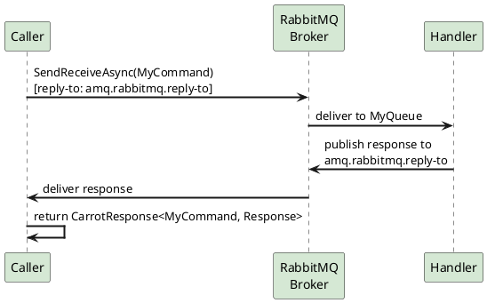
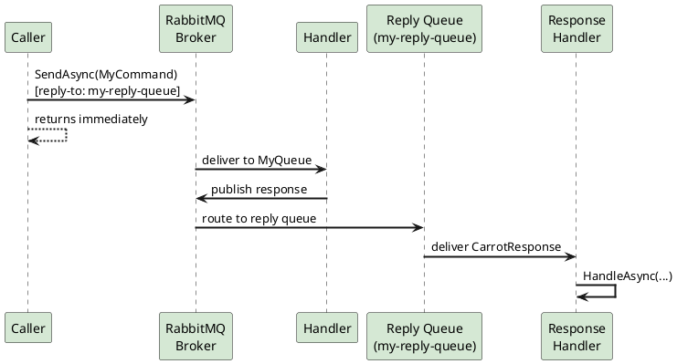

# Commands & Queries

CarrotMQ models RPC-style interactions over RabbitMQ using two intent-aware abstractions:

- **Commands** — instruct a service to mutate state (e.g. `CreateOrderCommand`).
- **Queries** — ask a service to return data without side effects (e.g. `GetOrderQuery`).

Both follow the **same request/response pattern**: the caller sends a message to a specific endpoint, a handler processes it, and a typed response is returned. The distinction between command and query is purely semantic and enforced at the type level, helping you apply CQRS conventions without any extra infrastructure.

---

## Defining DTOs

```csharp
public class MyCommand : ICommand<MyCommand, MyCommand.Response, MyQueue>
{
    public string Message { get; set; }

    public class Response
    {
        public string ResponseMessage { get; set; }
    }
}

public class MyQuery : IQuery<MyQuery, MyQuery.Response, MyQueue>
{
    public string Message { get; set; }

    public class Response
    {
        public string ResponseMessage { get; set; }
    }
}
```

- The first generic parameter is the message type itself (self-referential).
- The second is the strongly-typed response payload.
- The third is the target endpoint — typically a `QueueEndPoint`, but `ExchangeEndPoint` is also supported (see [Endpoints for Commands and Queries](../concepts/endpoints.md#endpoints-for-commands-and-queries)).

Nesting the `Response` class inside the DTO keeps related types co-located and avoids naming collisions across many commands.

---

## Sending Modes

All three sending modes are available on `ICarrotClient`.

### 1. `SendReceiveAsync` — Synchronous RPC

The caller blocks until the handler has processed the message and sent a response. Internally, CarrotMQ uses the **RabbitMQ Direct Reply-to** mechanism, so no dedicated reply queue needs to be provisioned.

```csharp
CarrotResponse<MyCommand, MyCommand.Response> response =
    await carrotClient.SendReceiveAsync(new MyCommand { Message = "Do it" });

if (response.StatusCode == 200)
    Console.WriteLine(response.Content?.ResponseMessage);
```

Use this mode when the caller needs the result before it can continue — equivalent to a synchronous HTTP call.



### 2. `SendAsync` with `QueueReplyEndPoint` — Async Reply

The command is dispatched to the handler queue and the caller returns immediately. The reply is delivered **asynchronously** to a dedicated reply queue. Register a `ResponseHandlerBase` or `ResponseSubscription` to receive and process responses when they arrive.

```csharp
await carrotClient.SendAsync(
    new MyCommand { Message = "Do it" },
    new QueueReplyEndPoint("my-reply-queue"));
```

- `"my-reply-queue"` — the queue where the handler will send its response.

Use this mode to decouple the sender from the response handler, enabling long-running operations, fan-out scenarios, or when the reply may arrive seconds or minutes later.



### 3. `SendAsync` with no reply endpoint — Fire and Forget

The command is sent to the handler queue and no reply is expected or requested. The handler may still process the message and produce side effects, but the caller will never receive a response. Omit the `replyEndPoint` argument (it defaults to `null`) to send without a reply.

```csharp
await carrotClient.SendAsync(new MyCommand { Message = "Do it" });
// replyEndPoint is null — no reply will be sent
```

Use this mode for one-way commands where the outcome does not matter to the caller (e.g. audit logging, cache invalidation).

---

## Choosing a Sending Mode

| Mode | Caller blocks? | Reply queue needed? | Typical use case |
|---|---|---|---|
| `SendReceiveAsync` | Yes | No (Direct Reply-to) | Synchronous RPC, short-lived ops |
| `SendAsync` + `QueueReplyEndPoint` | No | Yes | Async workflows, long-running ops |
| `SendAsync` (no reply endpoint) | No | No | One-way **commands** only, audit, eviction |

> [!NOTE]
> The fire-and-forget `SendAsync` overload with no `replyEndPoint` is only available for **commands** (`ICommand`). Queries (`IQuery`) always require a `replyEndPoint` because returning data to the caller is their primary purpose.

---

## Sending with `MessageProperties` and `Context`

Both `SendReceiveAsync` and `SendAsync` accept the same optional `MessageProperties` and `Context` parameters described in the [Publishing Events](publishing_events.md) guide. They behave identically for commands and queries.
