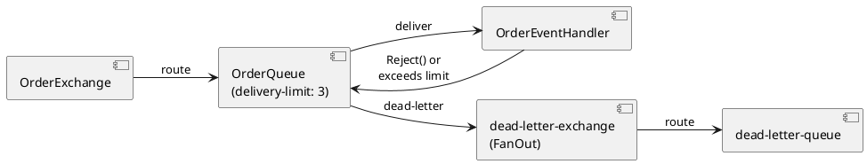

# Dead-Letter Queue Recipe

A **dead-letter queue** (DLQ) is a secondary queue that receives messages which could not be processed — either because they were rejected by a handler, exceeded the delivery limit on a quorum queue, or expired before being consumed. This recipe shows the full end-to-end pattern.

---

## When to Use a DLQ

| Scenario | What happens without a DLQ |
|---|---|
| Handler returns `Reject()` | Message is dropped |
| Quorum queue delivery limit exceeded | Message is dropped |
| Message TTL expires in the queue | Message is dropped |

With a DLQ, none of these messages are lost — they are routed to a separate queue where they can be inspected, alerted on, or reprocessed.

---

## Full Example

### 1. Define Marker Classes

```csharp
// Shared DTO project (CarrotMQ.Core only)
public class OrderQueue : QueueEndPoint
{
    public OrderQueue() : base("orders") { }
}

public class OrderExchange : ExchangeEndPoint
{
    public OrderExchange() : base("order-events") { }
}
```

No marker class is strictly required for the DLX or DLQ — you can use string names — but typed classes make refactoring safer.

### 2. Bootstrap

```csharp
services.AddCarrotMqRabbitMq(builder =>
{
    builder.ConfigureBrokerConnection(sectionName: "BrokerConnection");

    // Main exchange and queue
    var exchange = builder.Exchanges.AddDirect<OrderExchange>();

    var mainQueue = builder.Queues.AddQuorum<OrderQueue>()
        .WithDeadLetterExchange("dead-letter-exchange")   // DLX name
        .WithDeliveryLimit(3)                              // quorum queues only
        .WithConsumer(c => c.WithSingleAck());

    // Dead-letter exchange (FanOut — no routing key needed) and queue
    // FanOut is the simplest choice for a DLX: it captures dead-lettered messages
    // from any bound queue regardless of routing key.
    var dlx = builder.Exchanges.AddFanOut("dead-letter-exchange");
    var dlq = builder.Queues.AddQuorum("dead-letter-queue");

    dlx.BindToQueue(dlq);   // bind the DLX to the DLQ (empty routing key, FanOut ignores it)

    // Bind the main handler
    builder.Handlers.AddEvent<OrderEventHandler, OrderPlacedEvent>()
        .BindTo(exchange, mainQueue);

    builder.StartAsHostedService();
});
```

> [!NOTE]
> The DLQ is declared here without a consumer. Dead-lettered messages accumulate in it for inspection.
> To process them, add `.WithConsumer()` to the `dlq` builder and register a handler in the same **or a separate** service. Because CarrotMQ allows only one handler per message type per application, a dedicated consumer service is the cleanest option when you want both normal and dead-letter processing in separate processes.

### 3. Main Handler

```csharp
public class OrderEventHandler : EventHandlerBase<OrderPlacedEvent>
{
    private readonly IOrderRepository _repository;

    public OrderEventHandler(IOrderRepository repository)
        => _repository = repository;

    public override async Task<IHandlerResult> HandleAsync(
        OrderPlacedEvent message,
        ConsumerContext consumerContext,
        CancellationToken cancellationToken)
    {
        if (!message.IsValid())
            return Reject();    // unrecoverable — send to DLQ immediately

        await _repository.SaveAsync(message, cancellationToken);
        return Ok();
    }
}
```

---

## Message Flow



---

## Key Points

- **`WithDeliveryLimit(n)`** is a quorum-queue-only feature. Classic queues rely entirely on `Reject()` or message TTL for dead-lettering.
- **`Reject()`** routes the message to the DLX immediately, regardless of the delivery limit.
- **`Retry()`** requeues the message; the delivery limit counter (`x-delivery-count`) increments on each redelivery. Once the limit is reached, the message is dead-lettered automatically. The counter **never resets** — it is a cumulative count across all delivery attempts regardless of whether other messages between attempts were processed successfully.
- The DLX must be declared before or alongside the queue that references it. CarrotMQ handles declaration order automatically at startup.
- If no DLX is configured, rejected or expired messages are **silently dropped**.

> See [Queues](../configuration/queues.md) for full queue configuration options and [Error Handling](error_handling.md) for the acknowledgement semantics of each `IHandlerResult`.
