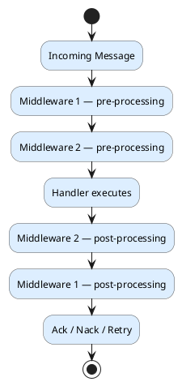

# Middleware Pipeline

CarrotMQ includes an ASP.NET Core-style middleware pipeline that wraps every incoming message before it reaches its handler. Middleware gives you a clean, composable place to add cross-cutting concerns — logging, tracing, validation, exception handling — without touching handler code.

---

### How the pipeline works

When a message arrives, CarrotMQ passes it through all registered `ICarrotMiddleware` implementations in registration order. Each middleware can execute logic **before** and **after** calling `next()`, which advances to the next stage. The final stage in the chain is the handler itself.



Middleware instances are resolved from the DI container and are **scoped** to each message processing cycle.

---

### The ICarrotMiddleware interface

Implement `ICarrotMiddleware` to create a middleware component:

```csharp
public interface ICarrotMiddleware
{
    Task InvokeAsync(MiddlewareContext context, Func<Task> nextAsync);
}
```

Call `nextAsync()` to pass control to the next middleware or the handler. Code before the call runs on the way in; code after runs on the way out.

#### Example: logging middleware

```csharp
public class MyLoggingMiddleware : ICarrotMiddleware
{
    private readonly ILogger<MyLoggingMiddleware> _logger;

    public MyLoggingMiddleware(ILogger<MyLoggingMiddleware> logger)
    {
        _logger = logger;
    }

    public async Task InvokeAsync(MiddlewareContext context, Func<Task> nextAsync)
    {
        _logger.LogInformation("Processing message of type {Type}", context.MessageType.Name);

        await nextAsync(); // call the next middleware or the handler

        _logger.LogInformation("Finished processing. Result: {Status}", context.DeliveryStatus);
    }
}
```

---

### MiddlewareContext properties

`MiddlewareContext` is the shared object passed through the entire pipeline. It carries both immutable message data and mutable state that middleware can read or modify.

| Property | Type | Description |
|---|---|---|
| `Message` | `CarrotMessage` | The raw message being processed, as received from the broker. |
| `MessageType` | `Type` | The .NET type of the deserialized message body. |
| `ConsumerContext` | `ConsumerContext` | Message metadata: `MessageId`, `CorrelationId`, `CreatedAt`, `CustomHeader`, and more. |
| `HandlerResult` | `IHandlerResult?` | The result set by the handler. Available after `await next()` returns. |
| `DeliveryStatus` | `DeliveryStatus` | Controls how the message is acknowledged. Can be overwritten by middleware to change the outcome (`Ack`, `Reject`, or `Retry`). |
| `ResponseRequired` | `bool` | `true` when the framework is expected to send a response back to the caller. |
| `ResponseSent` | `bool` | Set to `true` by middleware that has already sent the response, preventing the framework from sending a duplicate. |
| `IsErrorResult` | `bool` | Set to `true` when the handler or a middleware produced an error response. |
| `HandlerType` | `Type?` | The registered handler type for this message. `null` if no handler is registered. |
| `CancellationToken` | `CancellationToken` | Cancellation token for the processing operation. |

> [!TIP]
> Always inspect `HandlerResult` and `DeliveryStatus` **after** `await next()`. Properties set by the handler are only populated once the handler has run.

---

### Registering middleware

Register each middleware implementation as `ICarrotMiddleware` in the DI container. CarrotMQ's `IMiddlewareProcessor` discovers all registered `ICarrotMiddleware` services and applies them to the pipeline automatically.

```csharp
services.AddScoped<ICarrotMiddleware, MyLoggingMiddleware>();
```

Multiple middleware components are applied in the order they are registered:

```csharp
services.AddScoped<ICarrotMiddleware, TracingMiddleware>();
services.AddScoped<ICarrotMiddleware, ValidationMiddleware>();
services.AddScoped<ICarrotMiddleware, MyLoggingMiddleware>();
```

---

### Common use cases

| Use case | What to do in middleware |
|---|---|
| **Logging & tracing** | Log `MessageType`, `ConsumerContext.CorrelationId`, and `DeliveryStatus` before and after `next()`. |
| **Exception handling** | Wrap `await next()` in a `try/catch`; set `context.DeliveryStatus = DeliveryStatus.Retry` or `Reject` as appropriate. |
| **Message validation** | Validate the deserialized message before calling `next()`; set `DeliveryStatus = DeliveryStatus.Reject` and skip `next()` if invalid. |
| **Auditing** | Record `ConsumerContext.MessageId`, `CreatedAt`, and the handler outcome after `next()`. |
| **Dead-letter routing** | On error, set `DeliveryStatus = DeliveryStatus.Reject` to route the message to the configured dead-letter exchange. |
| **Modifying delivery status** | Inspect `context.IsErrorResult` after `next()` and override `context.DeliveryStatus` based on business rules. |
