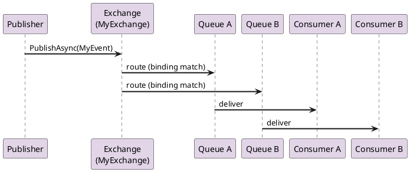

# Publishing Events

Events in CarrotMQ represent notifications that something has happened. They follow a **fire-and-forget** pattern: the publisher sends an event to a RabbitMQ exchange without waiting for a response, and the exchange routes it to one or more bound queues where interested consumers can process it independently.

---

## Static Routing with `IEvent`

`IEvent<TEvent, TExchange>` is the standard way to publish events when the routing destination is known at compile time. The event is published to the exchange defined by `TExchange`, and RabbitMQ routes it to all queues that match the binding. The routing key is derived from the **full type name** of the event class by default.

### Define the DTO

```csharp
public class MyEvent : IEvent<MyEvent, MyExchange>
{
    public string Message { get; set; }
}
```

- `MyEvent` — the event payload type.
- `MyExchange` — a class deriving from `ExchangeEndPoint` that describes the RabbitMQ exchange to publish to.

### Publish the Event

```csharp
await carrotClient.PublishAsync(new MyEvent { Message = "Hello from CarrotMQ" });
```

`ICarrotClient.PublishAsync` serialises the event and dispatches it to the configured exchange. Because routing is static, no additional configuration is required at the call site.

### Message Flow



---

## Dynamic Routing with `ICustomRoutingEvent`

Use `ICustomRoutingEvent` when the exchange and routing key must be decided at **runtime** — for example, when the same event payload needs to reach different targets depending on tenant, region, or any other runtime data.

### Define the DTO

```csharp
public class MyCustomRoutingEvent : ICustomRoutingEvent<MyCustomRoutingEvent>
{
    // Required by ICustomRoutingEvent<T>
    public required string Exchange { get; set; }
    public required string RoutingKey { get; set; }

    // Your payload
    public string Message { get; set; }
}
```

Unlike `IEvent<TEvent, TExchange>`, there is no generic exchange type parameter. The target exchange and routing key are set directly on the message object before publishing.

### Publish the Event

```csharp
await carrotClient.PublishAsync(new MyCustomRoutingEvent
{
    Exchange   = "my-exchange",
    RoutingKey = "my.key",
    Message    = "Hello"
});
```

### When to Use Dynamic Routing

| Scenario | Recommended type |
|---|---|
| All instances of the event go to the same exchange | `IEvent<TEvent, TExchange>` |
| Exchange or routing key varies per message | `ICustomRoutingEvent` |
| Multi-tenant fan-out to tenant-specific exchanges | `ICustomRoutingEvent` |

---

## Controlling Delivery with `MessageProperties`

Both overloads of `PublishAsync` accept an optional `MessageProperties` parameter that lets you fine-tune how RabbitMQ handles the message:

```csharp
await carrotClient.PublishAsync(
    new MyEvent { Message = "Important" },
    messageProperties: new MessageProperties
    {
        PublisherConfirm = true,   // Wait for broker ack (default: true)
        Persistent       = true,   // Survive broker restarts
        Priority         = 5,      // Message priority (0–9)
        Ttl              = 30_000  // Time-to-live in milliseconds
    });
```

| Property | Type | Default | Description |
|---|---|---|---|
| `PublisherConfirm` | `bool` | `true` | Waits for a broker acknowledgement before returning. Disable only if you can tolerate message loss. |
| `Persistent` | `bool` | `false` | Marks the message as durable (written to disk). Only relevant for classic queues — quorum queues are always persistent. |
| `Priority` | `byte` | `0` | Message priority (`0`–`9`). Requires a priority queue configured with a matching `x-max-priority` argument. |
| `Ttl` | `int?` | `null` | Time-to-live in milliseconds. A single value that governs three phases of the message lifecycle: (1) the publisher-side send timeout, (2) the AMQP `expiration` header controlling how long the message can wait in the queue, and (3) the consumer-side processing deadline passed via `CancellationToken` to `HandleAsync`. `null` means no TTL is applied at any phase. |

`MessageProperties` is a `record struct`. `MessageProperties.Default` is equivalent to `new MessageProperties { PublisherConfirm = true }`.

---

## Passing Context

An optional `Context` parameter lets you attach metadata that travels through the entire message chain. This is useful for distributed tracing, auditing, and correlation.

```csharp
await carrotClient.PublishAsync(
    new MyEvent { Message = "Hello" },
    context: new Context(
        initialUserName:    "alice",
        initialServiceName: "order-service",
        customHeader: new Dictionary<string, string>
        {
            ["correlation-id"] = "abc-123",
            ["tenant"]         = "acme"
        }
    ));
```

| Field | Description |
|---|---|
| `InitialUserName` | Identity of the user who originated the message |
| `InitialServiceName` | Name of the service that first published the message |
| `CustomHeader` | Arbitrary key-value pairs forwarded with every subsequent message in the chain |
