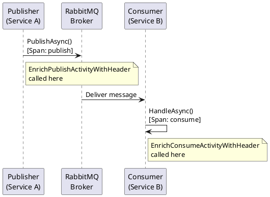

# OpenTelemetry Integration

CarrotMQ has built-in support for OpenTelemetry. It emits both **distributed traces** (via `Activity`) and **metrics** (via `Meter`) using the standard OpenTelemetry .NET API, with no additional packages required beyond the standard OpenTelemetry SDK.

---

## Built-in Instrumentation

| Signal | Name | Constant |
|---|---|---|
| Metrics | `CarrotMQ.Meter` | `Names.CarrotMeterName` |
| Traces | `CarrotMQ.ActivitySource` | `Names.CarrotActivitySourceName` |

Both constants are defined in `CarrotMQ.Core.Telemetry.Names`.

CarrotMQ automatically creates spans for publishing and consuming messages, and records metrics such as message counts and processing durations.

---

## Setup

Add OpenTelemetry to your host alongside CarrotMQ. Register the CarrotMQ meter and activity source so the SDK collects them:

```csharp
using CarrotMQ.Core.Telemetry;
using OpenTelemetry;
using OpenTelemetry.Metrics;
using OpenTelemetry.Resources;
using OpenTelemetry.Trace;

appBuilder.Services.AddOpenTelemetry()
    .ConfigureResource(r => r.AddService("MyService"))
    .WithMetrics(metrics =>
    {
        metrics.AddMeter(Names.CarrotMeterName);
        metrics.AddRuntimeInstrumentation();
        // Export to OTLP, Prometheus, etc.
    })
    .WithTracing(tracing =>
    {
        tracing.AddSource(Names.CarrotActivitySourceName);
        // Export to Jaeger, Zipkin, OTLP, etc.
    })
    .UseOtlpExporter(); // or your preferred exporter
```

> **Tip**: Replace `.UseOtlpExporter()` with the exporter appropriate for your observability backend (e.g. `AddJaegerExporter()`, `AddZipkinExporter()`, `AddPrometheusExporter()`).

---

## Tracing Customisation via CarrotTracingOptions

You can enrich CarrotMQ spans with additional tags or baggage using `CarrotTracingOptions`.

### Configuration in Code

```csharp
builder.ConfigureTracing(configureOptions: options =>
{
    options.EnrichPublishActivityWithHeader = (activity, header) =>
    {
        activity.SetTag("tenant.id", header.CustomHeader?.GetValueOrDefault("X-Tenant-Id"));
    };

    options.EnrichConsumeActivityWithHeader = (activity, header) =>
    {
        activity.SetTag("tenant.id", header.CustomHeader?.GetValueOrDefault("X-Tenant-Id"));
    };
});
```

### Configuration via appsettings.json

The `CarrotTracing` section is read from configuration, but because `EnrichPublishActivityWithHeader` and `EnrichConsumeActivityWithHeader` are delegate properties, they **cannot be set from JSON** — they must always be configured in code as shown above.

```json
{
  "CarrotTracing": {}
}
```

See [AppSettings Reference](../advanced/appsettings.md) for section name customisation.

---

## Enrichment Hooks

| Hook | Signature | Description |
|---|---|---|
| `EnrichPublishActivityWithHeader` | `Action<Activity, CarrotHeader>` | Called when a publish span is started. Add tags or baggage derived from the outgoing message header. |
| `EnrichConsumeActivityWithHeader` | `Action<Activity, CarrotHeader>` | Called when a consume span is started. Add tags or baggage derived from the incoming message header. |

### The CarrotHeader Object

The `CarrotHeader` passed to both hooks exposes:

| Property | Description |
|---|---|
| `ServiceName` | Name of the service that originally published the message. |
| `InitialUserName` | Identity of the user associated with the originating request. |
| `InitialServiceName` | Name of the service that initiated the original request chain. |
| `CustomHeader` | `IDictionary<string, string>?` — arbitrary key/value pairs set via `Context.CustomHeader` at publish time. May be `null` if no custom headers were set. |

### Example: Propagating a Tenant ID

```csharp
builder.ConfigureTracing(configureOptions: options =>
{
    options.EnrichPublishActivityWithHeader = (activity, header) =>
    {
        activity.SetTag("tenant.id", header.CustomHeader?.GetValueOrDefault("X-Tenant-Id"));
    };
});
```

Set the custom header when publishing:

```csharp
// Pass a context with the custom header when publishing
await carrotClient.PublishAsync(
    myEvent,
    context: new Context(customHeader: new Dictionary<string, string>
    {
        ["X-Tenant-Id"] = tenantId
    }));
```

---

## Trace Flow Diagram



---

## Meter Instruments Reference

All instruments are published under the meter named `CarrotMQ.Meter` (`Names.CarrotMeterName`).

### Metrics

| Instrument Name | Type | Unit | Description | Tags |
|---|---|---|---|---|
| `carrotmq-request-duration-ms` | `Histogram<double>` | milliseconds | Distribution of message processing durations from delivery to final acknowledgement. | — |
| `carrotmq-active-requests-counter` | `UpDownCounter<long>` | count | Number of messages currently being processed. Incremented when processing starts, decremented when it ends. | — |
| `carrotmq-request-counter` | `Counter<long>` | count | Total number of messages received and dispatched to a handler. | `CalledMethod` |
| `carrotmq-response-counter` | `Counter<long>` | count | Total number of responses sent back to callers. | `CalledMethod`, `StatusCode` |
| `carrotmq-message-delivery-counter` | `Counter<long>` | count | Total number of messages acknowledged, rejected, or retried. | `DeliveryStatus` |

### Activity (Span) Names and Tags

All spans belong to the activity source named `CarrotMQ.ActivitySource` (`Names.CarrotActivitySourceName`).

| Scenario | Activity Kind | Activity Name | Tags Set |
|---|---|---|---|
| Publishing a message | `ActivityKind.Producer` | `header.CalledMethod` (the message type key) | `carrotmq.service_name`, `carrotmq.v_host` |
| Consuming a message | `ActivityKind.Consumer` | `header.CalledMethod` (the message type key) | `carrotmq.remote_service_name`, `carrotmq.service_name`, `carrotmq.v_host` |

Trace context (`TraceId`, `SpanId`) is propagated via the `CarrotHeader` embedded in each message, enabling correlation across service boundaries without any additional configuration.
